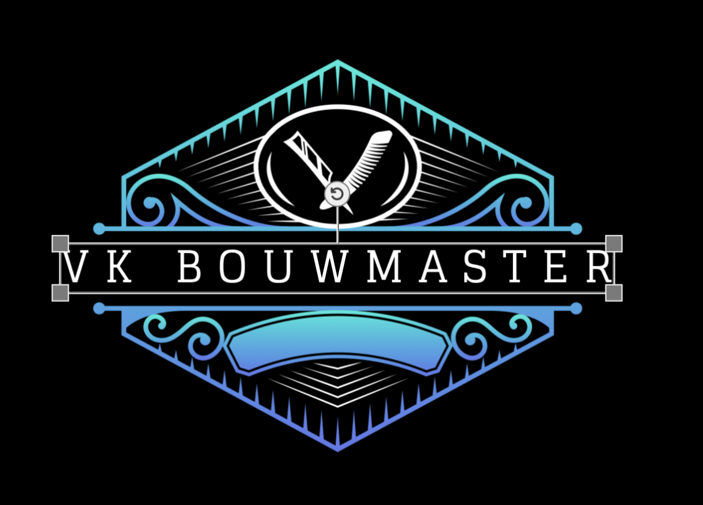

# VK BOUWMASTER

Современный веб-сайт для строительной компании VK BOUWMASTER, специализирующейся на ремонтных и строительных услугах в Нидерландах.



## 🏗️ О проекте

VK BOUWMASTER - это профессиональная строительная компания, предоставляющая широкий спектр услуг по ремонту и строительству. Сайт построен на современном стеке технологий Next.js с поддержкой многоязычности и адаптивного дизайна.

## 📸 Скриншоты

**Главная страница:** [homepage1.png](docs/images/homepage1.png) | [homepage2.png](docs/images/homepage2.png) | [homepage3.png](docs/images/homepage3.png) | [homepage4.png](docs/images/homepage4.png) | [homepage5.png](docs/images/homepage5.png) | [homepage6.png](docs/images/homepage6.png) | [homepage7.png](docs/images/homepage7.png)

**О нас (`/about`):** [about1.png](docs/images/about1.png) | [about2.png](docs/images/about2.png) | [about3.png](docs/images/about3.png) | [about4.png](docs/images/about4.png) | [about5.png](docs/images/about5.png) | [about6.png](docs/images/about6.png)

**Портфолио (`/portfolio`):** [portfolio1.png](docs/images/portfolio1.png) | [portfolio2.png](docs/images/portfolio2.png) | [portfolio3.png](docs/images/portfolio3.png) | [portfolio4.png](docs/images/portfolio4.png) | [portfolio5.png](docs/images/portfolio5.png) | [portfolio6.png](docs/images/portfolio6.png) | [portfolio7.png](docs/images/portfolio7.png)

**Отзывы (`/reviews`):** [reviews1.png](docs/images/reviews1.png) | [reviews2.png](docs/images/reviews2.png) | [reviews3.png](docs/images/reviews3.png)

**Контакты (`/contact`):** [contact1.png](docs/images/contact1.png) | [contact2.png](docs/images/contact2.png) | [contact3.png](docs/images/contact3.png)

**Админ-панель (`/admin`):** [admin-login.png](docs/images/admin-login.png) | [admin1.png](docs/images/admin1.png) | [admin2.png](docs/images/admin2.png) | [admin3.png](docs/images/admin3.png) | [admin4.png](docs/images/admin4.png) | [admin5.png](docs/images/admin5.png)

## ✨ Основные возможности

- 🌍 **Многоязычность** - поддержка 25 языков
- 📱 **Адаптивный дизайн** - отлично работает на всех устройствах
- 🎨 **Современный UI/UX** - красивые анимации и интерактивные элементы
- 🖼️ **Портфолио проектов** - галерея выполненных работ
- 💬 **Отзывы клиентов** - система отзывов и комментариев
- 📧 **Контактная форма** - удобная форма обратной связи
- 🔐 **Админ-панель** - управление контентом сайта

## 🛠️ Технологии

- **Next.js 15.5** - React фреймворк с App Router
- **TypeScript** - типизированный JavaScript
- **Tailwind CSS 4** - утилитарный CSS фреймворк
- **Framer Motion** - библиотека анимаций
- **Three.js** - 3D графика и шейдеры
- **Radix UI** - компоненты интерфейса
- **Nodemailer** - отправка email
- **Vercel Blob** - хранение файлов

## 📦 Установка

1. Клонируйте репозиторий:
```bash
git clone https://github.com/ITty-Company/vk-bouwmaster.git
cd vk-bouwmaster
```

2. Установите зависимости:
```bash
npm install
```

3. Создайте файл `.env.local` с необходимыми переменными окружения:
```env
# Email настройки (для контактной формы)
SMTP_HOST=your-smtp-host
SMTP_PORT=587
SMTP_USER=your-email
SMTP_PASS=your-password
RECIPIENT_EMAIL=your-recipient-email

# Telegram уведомления (для контактной формы)
# Создайте бота через @BotFather и получите token.
# CHAT_ID: ваш id или id группы/канала (для групп обычно отрицательный).
TELEGRAM_BOT_TOKEN=123456:ABCDEF-your-token
TELEGRAM_CHAT_ID=123456789

# OpenAI API (для переводов, опционально)
OPENAI_API_KEY=your-openai-key

# Vercel Blob (для загрузки файлов)
BLOB_READ_WRITE_TOKEN=your-blob-token

# (Опционально) Путь для хранения данных в runtime
COMMENTS_FILE_PATH=data/comments-data.json
CONTACT_FILE_PATH=data/contact-data.json
CONTACT_MESSAGES_FILE_PATH=data/contact-messages.json
```

## 🚀 Запуск

### Разработка

Запустите сервер разработки:

```bash
npm run dev
```

Откройте [http://localhost:3000](http://localhost:3000) в браузере.

### Продакшн

Соберите проект:

```bash
npm run build
```

Запустите продакшн сервер:

```bash
npm start
```

## 📁 Структура проекта

```
├── src/
│   ├── app/              # Next.js App Router страницы
│   │   ├── api/          # API routes
│   │   ├── admin/        # Админ-панель
│   │   ├── portfolio/    # Портфолио проектов
│   │   ├── services/     # Страницы услуг
│   │   └── ...
│   ├── components/       # React компоненты
│   │   ├── layout/       # Компоненты макета
│   │   └── ui/           # UI компоненты
│   ├── contexts/         # React контексты
│   ├── hooks/            # Custom hooks
│   └── lib/              # Утилиты и данные
├── public/               # Статические файлы
└── ...
```

## 🎯 Основные страницы

- `/` - Главная страница
- `/services` - Услуги
- `/portfolio` - Портфолио
- `/reviews` - Отзывы
- `/contact` - Контакты

## 🌐 Поддерживаемые языки

Сайт поддерживает **25 языков**:

- 🇬🇧 Английский (EN)
- 🇳🇱 Нидерландский (NL)
- 🇩🇪 Немецкий (DE)
- 🇫🇷 Французский (FR)
- 🇪🇸 Испанский (ES)
- 🇮🇹 Итальянский (IT)
- 🇵🇹 Португальский (PT)
- 🇵🇱 Польский (PL)
- 🇨🇿 Чешский (CZ)
- 🇭🇺 Венгерский (HU)
- 🇷🇴 Румынский (RO)
- 🇧🇬 Болгарский (BG)
- 🇭🇷 Хорватский (HR)
- 🇸🇰 Словацкий (SK)
- 🇸🇮 Словенский (SL)
- 🇪🇪 Эстонский (ET)
- 🇱🇻 Латвийский (LV)
- 🇱🇹 Литовский (LT)
- 🇫🇮 Финский (FI)
- 🇸🇪 Шведский (SV)
- 🇩🇰 Датский (DA)
- 🇳🇴 Норвежский (NO)
- 🇷🇺 Русский (RU)
- 🇺🇦 Украинский (UA)
- 🇬🇷 Греческий (GR)

## 📝 Скрипты

- `npm run dev` - запуск dev сервера с Turbopack на `0.0.0.0` (доступен из сети)
- `npm run build` - сборка проекта для продакшна
- `npm start` - запуск продакшн сервера на порту из переменной `PORT` (по умолчанию 3000)
- `npm run lint` - проверка кода с помощью ESLint

## 🔧 Конфигурация

### Next.js

Конфигурация находится в `next.config.ts`. Настроены:

- **Remote patterns для изображений** - поддержка загрузки изображений с:
  - `images.unsplash.com`
  - `vkbouwmaster.com` и `www.vkbouwmaster.com`
  - `*.blob.vercel-storage.com` (Vercel Blob Storage)
  - `vk-bouwmaster.onrender.com`
  - `localhost` (для разработки)
- **Оптимизация изображений** - включена оптимизация Next.js Image
- **Интернационализация** - кастомная система переводов (без встроенного i18n Next.js для совместимости с App Router)

### Tailwind CSS

Конфигурация в `postcss.config.mjs`. Используется:
- **Tailwind CSS 4** - последняя версия через `@tailwindcss/postcss` плагин
- Кастомные темы и градиенты определены в `globals.css`

## 📄 Лицензия

Проект является частной собственностью VK BOUWMASTER.

## 👥 Команда

Разработано для VK BOUWMASTER компанией ITty Company.

## 🔗 Ссылки

- 🌐 [Веб-сайт](https://vkbouwmaster.com)
- 📦 [GitHub - ITty Company](https://github.com/ITty-Company/vk-bouwmaster)
- 📦 [GitHub - kkrasnova](https://github.com/kkrasnova/vk-bouwmaster)

## 📞 Контакты

Для вопросов и предложений обращайтесь:

- 📱 **Instagram**: [@ittycompany](https://www.instagram.com/ittycompany/)
- 💬 **Telegram / Viber / WhatsApp**: [+380953398039](tel:+380953398039)

---

Сделано с ❤️ для VK BOUWMASTER

